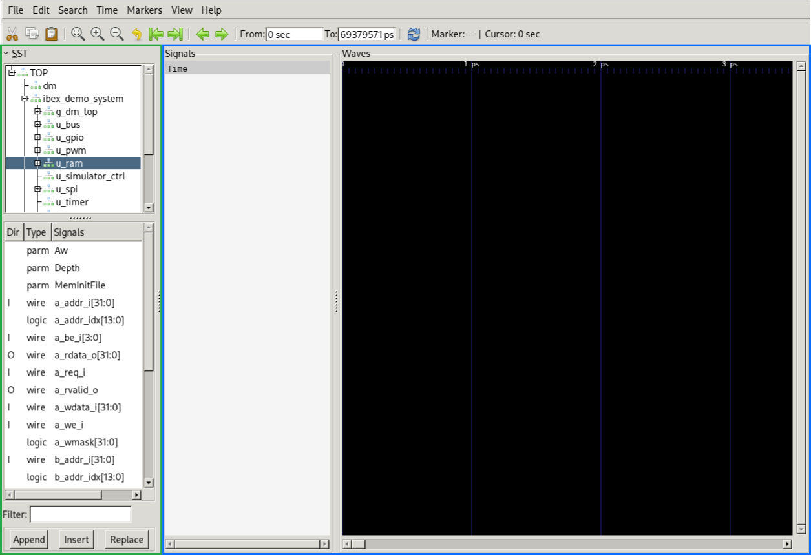
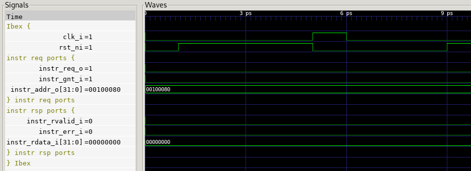

# Lab 2: Simulating with Verilator+GTKWave and modifying a HW peripheral
<!-- Please write one sentence per line, as this facilitates version control. -->
<!-- Put sample solution in comment below a question. -->

In this second lab, you will learn how to modify a hardware peripheral and how to simulate the system with Verilator and inspect the simulation waves with GTKWave.

## Simulating with Verilator

[Verilator](https://verilator.org) is a widely-used simulator for Verilog and SystemVerilog.
It compiles RTL code to a multithreaded C++ executable, which makes Verilator much faster than other simulators in many cases.
Verilator is free software (licensed LGPLv3).
If you have not installed Verilator yet, please [install it now](https://verilator.org/guide/latest/install.html).

Next, build the Verilator simulation executable of the Ibex demo system by invoking FuseSoC in the root directory of the demo system:
```
fusesoc --cores-root=. run --target=sim --tool=verilator \
        --setup --build lowrisc:ibex:demo_system
```

This will create an executable at
```
./build/lowrisc_ibex_demo_system_0/sim-verilator/Vibex_demo_system
```

Now start the simulation by invoking that executable with two flags: the first flag enables the capturing of wave traces, and the second flag loads the `demo` binary into program memory
```
./build/lowrisc_ibex_demo_system_0/sim-verilator/Vibex_demo_system \
    -t --meminit=ram,$(pwd)/sw/build/demo/demo
```

The simulation will run until you press `Ctrl+C`.
As no outputs (such as UART or GPIO) are mapped to the Verilator console, the console output does not indicate much activity.
However, the simulation is actively running and wave traces are continuously being written to a file called `sim.fst`.
Let's inspect them.


## Inspecting waves with GTKWave

[GTKWave](https://gtkwave.sourceforge.net/gtkwave.pdf) is a free (licensed GPLv2) wave viewer that supports many file formats.
If you have not installed it yet, please do so now (preferrably using your distribution's package manager, alternatively by building from source following the instructions in the linked manual).
Start GTKWave through your desktop's launcher or by entering `gtkwave` in a new shell.
Then open the trace file of our simulation by clicking **File** -> **Open New Tab** and selecting `sim.fst` inside the root directory of the Ibex demo repository.

A GTKWave tab has two main parts: the signal search tree (SST) on the left (green rectangle in screenshot below) and the signal wave display on the right (blue rectangle).



Navigate the tree of instances by expanding an instance (clicking the plus symbol left of the instance name) to expose the list of instances inside.
For example, the instantiated `ibex_demo_system` module resides at `TOP` -> `ibex_demo_system`.
Inside that, you can find our peripherals (`u_gpio`, `u_pwm`, `u_spi`, and `u_timer`), the on-chip memory (`u_ram`), and the Ibex core (`u_top` -> `u_ibex_core`).

Selecting an instance (clicking the instance name) shows the signals of that instance in the lower part of the SST.
Double-clicking on a signal appends it to the signal wave display on the right.

### Ibex instruction interface
Let's find out what instructions Ibex is fetching.
Select the `u_ibex_core` instance and first add the `clk_i` and `rst_ni` signals.
(It is good practice to always add those signals when inspecting the waves of a synchronous design.)
Then add the following signals of the instruction request ports
- `instr_req_o`
- `instr_gnt_i`
- `instr_addr_o`

as well as these signals of the instruction response ports
- `instr_rvalid_i`
- `instr_err_i`
- `instr_rdata_i`

You can optionally group the signals by clicking **Edit** -> **Create Group** (or pressing `G`).
This can be useful to visually identify which signals belong together.

When you are done, your signal wave display should look similar to this:


Now use the signal waves to find the first instruction requested by Ibex.
The instruction fetch protocol stipulates that a request occurs when `instr_req_o` and `instr_gnt_i` are both high on a rising clock edge (and outside the active-low reset, of course).
Clicking on a signal name and using the *Find Next Edge* functionality (the arrow pointing to the right in the toolbar) can help.
If needed, you can zoom in and out on the time axis by clicking the magnifier glass `+`/`-` icons in the toolbar or pressing the keyboard shortcuts listed in the **Time** -> **Zoom** menu.
What is the address of the first instruction, and what is its returned value?
<!-- address: 32'h0010_0080, data: 32'h5F40_006F -->

When observing instructions in wave traces, it often makes sense to correlate them with the disassembled binary.
To disassemble the binary, execute
```
riscv32-unknown-elf-objdump -d sw/build/demo/demo
```

Search the output of that command for the instruction address (first column).
The instruction value (second column) should match what you observed in the wave trace.
What does the instruction do?
<!-- j 100674 <reset_handler>; i.e., jump to the reset_handler function at address 0x100674. -->

Note that the instruction *fetched* in any given cycle is not the same as the instruction *executed* in that cycle, because Ibex is a pipelined CPU.
To correlate instructions with outputs of the CPU (e.g., to the register file or the memory), it is thus useful to know the program counter (PC) of the Execute stage.
This PC is easily accessible under `u_top` -> `crash_dump_o` (in the tree, not in the signal list) -> `current_pc`.
We recommend that you add this signal to the wave display.

### Ibex data interface

Another important part for understanding Ibex's actions in the system is the data interface, through which Ibex accesses memories and memory-mapped peripherals.
Add the `data_req_o`, `data_gnt_i`, `data_addr_o`, `data_we_o`, `data_wdata_o`, and `data_be_o` signals of the request ports and the `data_rvalid_i`, `data_rdata_i`, and `data_err_i` signals of the response ports.

What is the first address that Ibex accesses after reset?
Is this access a read or a write?
<!-- write of 0 to 32'h0010_0730 -->

Which instruction is executed when this memory access happens?
(Hint: Obtain the instruction address from `current_pc` and search for that address in the disassembled binary.)
What does the basic block containing the instruction do?
(Hint: A basic block is a sequence of instructions with no branches in (except to the entry) or out (except at the exit).)
<!-- A store of 0 to the address in a register; the basic block is a loop that fills a memory region with zeros. -->

Investigating the system memory map, which is defined by the `localparam`s near the top of `rtl/system/ibex_demo_system.sv`, we can see that the address belongs to the on-chip memory.
Not all data addresses correspond to memory, however.
The next entry in the address map shows that the GPIO peripheral has a space of 4 KiB starting at `32'h8000_0000` (and thus ending at `32h'8000_0FFF`).

We know that the demo program should access the GPIO peripheral, so let's identify that access in the waves.
For such a task, Verilator has a very useful function that allows searching the waves for values.
Select `data_req_o`, `data_gnt_i`, and `data_addr_o` in the signal wave display, and then click **Search** -> **Pattern Search 1**.
The window that opens defines matches in two steps: firstly defining the conditions for individual signals, and secondly defining the relation of those conditions.
We are interested in the case when `data_req_o` and `data_gnt_i` are high and `data_addr_o` has a hexadecimal value of `80000000`.
To this end, make the following settings:


Click the **Fwd** button to advance the cursor to Ibex's first access of the GPIO.
What does it do?
<!-- Write 0 to the GPIO register. -->

Then add the relevant signals from inside the GPIO module (`ibex_demo_system` -> `u_gpio`) to ascertain that the GPIO module does what Ibex wants.

As you have now put quite some effort into configuring the wave display, it may make sense to save it.
To do so, click **File** -> **Write Save File**.


## Adding a shift register to the GPIO peripheral

As you have just noticed, the software interface of the GPIO peripheral is very simple.
Let's extend its functionality by integrating a shift register specified as follows:
- A write to offset `0xC` of the GPIO peripheral shifts the current bits of the GPIO output up by one position and sets the least-significant bit (LSB) of the shift register to the LSB of the value written.
- A read to offset `0xC` of the GPIO peripheral returns the current bits of the GPIO output.

Modify the RTL code of the GPIO peripheral (under `rtl/system/gpio.sv`) to implement this functionality.
We recommend doing this in two steps:
1. Implement the address decoder for accessing the shift register (you can get inspiration from the existing address decoder code).
2. Implement the shift register functionality in the sequential block that sets the value of `gp_o`.
   This needs to be conditional on the address decoding implemented in the first step and use the data written by Ibex (`device_wdata_i`) as well as the current value of the GPIO output (`gp_o`).
<!-- sample solution: last commit on the [`sample-solution/lab2` branch](https://github.com/lowRISC/ibex-demo-system/commits/sample-solution/lab2) branch -->

When you are done, rebuild the Verilator simulation executable.

To enable this feature in the `demo` program, change the `0` in `#define USE_GPIO_SHIFT_REG 0` near the top of `sw/demo/hello_world/main.c` to `1` and recompile the `demo` binary.

Rerun the simulation, reload the wave traces (clicking the circular arrow button in the toolbar or **File** -> **Reload Waveform**), and add the relevant waves to check that your GPIO shift register works as expected.
