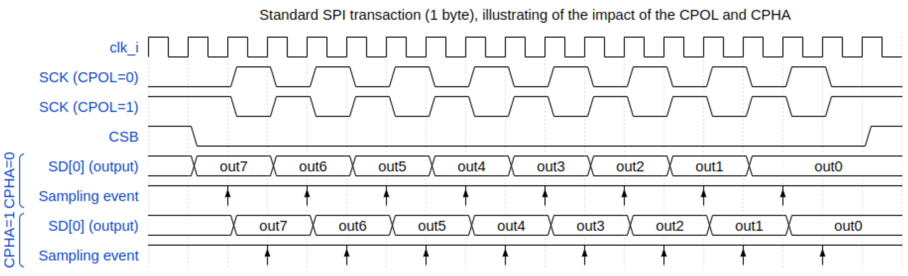

# Lab 3: Using the LCD Display over SPI
<!-- Please write one sentence per line, as this facilitates version control. -->
<!-- Put sample solution in comment below a question. -->

In this third lab, you will learn how to interface an LCD Display over a serial protocol (SPI), and you will draw a custom shape on the LCD display.


## Understanding the Serial Peripheral Interface (SPI) module

SPI is a serial communication interface mainly used for short-distance communication between integrated circuits (ICs).
SPI has two main variations, 4-wire and 3-wire.
The Ibex demo system supports both, and our LCD screen uses the 3-wire version.
This means the Ibex demo system receives and transmits data through the same wire (`SDA`).
As SPI is not a formal standard, there is no formal standard of it.
For this lab, we provide a simple SPI module to fit the requirements of an LCD screen.

Depending on the two parameters Clock Polarity (`CPOL`) and Clock Phase (`CPHA`), SPI communication can occur in one of four different modes.
We use default parameters of `CPOL=0` and `CPHA=1`, as required by the LCD screen.
`CPOL=0` means that when there is no transmission, the serial clock (`SCK`) is LOW.
`CPHA=1` means that data is transmitted at the positive edge of `SCK`.



The SPI block in the Ibex demo system consists of two modules inside the `spi_top` wrapper module: (1) the `prim_fifo_sync` first-in first-out (FIFO) module, which enables software to write data to be transmitted without having to wait for the transmission of individual bits, and (2) the `spi_host` module, which gets the data in 8-bit bytes from the FIFO and sends it bit by bit with a generated serial clock.
Note that `spi_host` will request data from FIFO as long as it's not empty.

The serial clock is generated by a simple counter.
The width and the limit of the counter are determined by the verilog module parameters `ClockFrequency` and `BaudRate`, and they are currently set to generate a frequency of 12.5 MHz.
When the `spi_host` module reads a byte from the FIFO, a second counter begins counting down from 7 to 0, which is the index of the bit in the byte that is being transmitted. Therefore the most significant bit is sent first.

The hardware FIFO has a standard interface, consisting of `clk,wdata,wdata_valid,rdata,rdata_valid,rdata_ready,full,empty`. To fill up the FIFO and thus to send data using SPI, software needs to write to a register named `TX` at the address `0x80004000`, of which the lowest 8 bits is mapped to the `wdata` port. Software needs to write to this register byte by byte.
There is also a status register named `STATUS_REG` at address `0x80004004` which has the fields for `full` at bit 0 and `empty` at bit 1.

What might be some use cases for `FIFO_EMPTY` and `FIFO_FULL`?
<!-- Sample solution: FIFO_FULL can be used to prevent data loss when SPI clock was too slow compared to the system clock by waiting to write new data until FIFO is not full again. FIFO_EMPTY can be used to check if the transmission is over. -->


## Drawing on the LCD display

The LCD display is connected to the Ibex demo system via SPI. This particular display used can be found online by searching for "Arduino 1.8 TFT Display". To drive the display panel itself, we communicate with a driver chip on the board with the part number of ST7735. You can think about the driver chip as the API to the display, which is what our software will be written against. You can find the datasheet for it [here](https://www.displayfuture.com/Display/datasheet/controller/ST7735.pdf).
A display driver (under `vendor/display_drivers`) implements low-level functions to write commands and data serially to the LCD display.
The commands and data formats are extracted from the data sheet of the LCD display module.
On top of these low-level functions, the driver provides functions for initializing the display, setting the orientation, clearing it, and for drawing individual pixels, vertical and horizontal lines, rectangles, characters, strings, and bitmaps.

Let's use the existing functions for drawing shapes to create a new function that draws a shape composed of horizontal and vertical rectangles.
We suggest you complete the implementation of the following function template, which draws a cross defined by a center point, the length of one arm, and a color:
```c
Result lcd_st7735_draw_cross(St7735Context *ctx,
                             LCD_Point center,
                             uint16_t length,
                             uint32_t color);
```
Alternatively, you can implement the drawing function for a shape of your own choice.
Create the function in `sw/demo/lcd_st7735/main.c`, and don't forget the local function declaration if needed.
<!-- Sample solution on the `sample-solution/lab3` branch. -->

When you are done, you can see your implementation in action on the LCD by adding a third item to the menu `items[]` array, e.g., `"3. Cross"` and then changing the reaction to a press of Button 3 to the following:
```c
case BTN3:
  lcd_st7735_clean(&lcd);
  lcd_st7735_draw_cross(&lcd, (LCD_Point){.x = 20, .y = 30}, 10, BGRColorRed);
break;
```
Recompile the program, and execute it on the FPGA. Check that the shape drawn is what you expected!


## Rendering a Mandelbrot set

As we can draw arbitrary bitmaps on the display, let's put Ibex to work calculating and drawing the [Mandelbrot set](https://en.wikipedia.org/wiki/Mandelbrot_set).
The LCD demo program already includes the code for that, that should be the default shown on the display when loading the binary `sw/build/demo/lcd_st7735/lcd_st7735`.


## Measuring computation cycles and displaying them

While admiring Ibex's work, we may wonder how many cycles the actual computations take.
The demo includes a floating point implementation and a fixed point implementation.
Ibex doesn't have hardware floating point support so software emulation is used instead.
Because of this the fixed point implementation is faster than the floating point.
To find out how much faster, let's use Ibex's cycle counter.
For this, `demo_system.h` declares two functions to get the value of the cycle counter and to reset it, respectively:
```c
uint32_t get_mcycle(void);
void reset_mcycle(void);
```

Let's use these functions to count the number of cycles Ibex spends for calculations in the `fractal_mandelbrot_float` function:

1. Add `#include "demo_system.h"` near the top of `sw/demo/lcd_st7735/fractal_float.c`.
2. Append an argument `unsigned int *compute_cycles` to the `fractal_mandelbrot_float` function signature in `fractal_float.c` and `fractal.h`.
3. Initialize the cycle count to zero so it can be used for summing up; i.e., add `*compute_cycles = 0;` to the top of the body of `fractal_mandelbrot_float`.
4. Find the inner computation loop of the fractal.
   Put `reset_mcycle();` before it and `*compute_cycles += get_mcycle();` after it.
5. In the `fractal_test` function of `sw/demo/lcd_st7735/main.c`, declare a variable to hold the compute cycle count and pass it as last argument to `fractal_mandelbrot_float`.
6. After the call to `fractal_mandelbrot_float`, use the following snippet to print the number of cycles taken on the LCD:
```c
unsigned int compute_cycles;
fractal_mandelbrot_float(lcd, &compute_cycles);
char buf[32];
snprintf(buf, 32, "cycles: %10d", compute_cycles);
lcd_st7735_puts(lcd, (LCD_Point){.x = 0, .y = 0}, buf);
timer_delay(5000);
```
7. Add `#include <stdio.h>` near the top of `sw/demo/lcd_st7735/main.c`.
8. Recompile the program and execute it on the FPGA.
<!-- Sample solution on the `sample-solution/lab3` branch. -->

Now do the same for the fixed point implementation (`fractal_mandelbrot_fixed` in `sw/demo/lcd_st7735/fractal_fixed.c`).

How many cycles does it take Ibex to compute the fractal for the floating and fixed point versions?
<!-- 1,186,511,608 cycles for the inner loop-->
