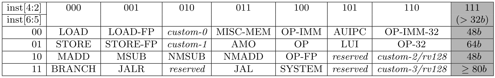
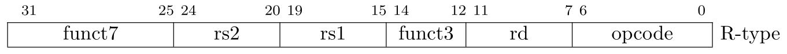

# Lab 4: Adding Custom Instructions to Ibex

In Lab 3 we saw the difference in performance between the fixed and floating point Mandelbrot implementations, can we get further performance improvements?
We can add custom RISC-V instructions to use dedicated hardware for computing the Mandelbrot set.
This lab covers the process of adding such custom instructions, though before we look at how we add them, let's take a quick look at how you calculate a Mandelbrot set.

## Drawing the Mandelbrot set

This is not a mathematics lab, so we're not going into lots of detail here nor does it matter if you don't really understand it, it's just the 'nuts and bolts' of the calculation you need to work with.
Before we can draw the Mandelbrot set, we first need to be able to work with complex numbers.

### Complex Number Intro

A complex number can be written as $a + bi$, where $a$ and $b$ are real numbers and $i = \sqrt{-1}$ is the *imaginary unit*.
$a$ is called the *real part*, and $b$ is called the *imaginary part*.

To add complex numbers, simply sum the real and imaginary parts:

$$(a + bi) + (c + di) = (a + c) + (b + d)i$$

To mutiply complex numbers, the components are multiplied by standard algebraic rules:

$$(a + bi) (c + di) = ac + adi + bci + bdi^2 = (ac - bd) + (ad + bc)i$$

Noting that $i^2 = -1$.

Finally, the absolute value $|C|$ of a complex number $C = a + bi$ is defined as:

$$|C|^2 = a^2 + b^2$$

Noting we would need a square root to get the absolute value, but for our purposes the squared value is fine.

### Mandelbrot Set Calculation

The Mandelbrot set is a set of complex numbers.
A number $C$ is in the set if the recurrance below never diverges to infinity (i.e., $|Z_n|$ is a finite number for all $n$).

$$Z_0 = C$$

$$Z_{n+1} = Z_n^2 + C$$

It can be shown that if $|Z_n| > 2$ for any $n$, then the recurrence will diverge and hence $C$ is not part of the Mandelbrot set.

To draw the set, we map pixels to real and imaginary numbers and calculate a certain number of iterations of the $Z_n$ recurrence for each point to decide if the point is in the set:

- If $|Z_n| \leq 2$ (noting we can just test the square result against 4 to avoid a square root) for all iterations, we declare the point *in* the set.
- If $|Z_n| > 2$ for any iteration, we terminate the iterations there and declare the point *not* in the set.

We finally colour the result based upon the number of iterations we reached before making our decision.

## Complex number custom instructions

Note: These are toy instructions for demonstration use, a 'real' complex number extension may do things differently, in particular the clamping and truncation behaviour discussed below.

Our fixed point implementation of the Mandelbrot set renderer uses 16-bit numbers (12 fractional bits, 4 integer bits with 2s complement representation).
This means we can pack a complex number into a single 32-bit number.
So how about some custom instructions that implement complex number operations on the packed 32 bit representation?

We are going to want three new instructions:

* complex multiply
* complex add
* complex absolute value (squared)

These will fit into the same instruction type used by the the ALU operations (add, sub, xor etc).
All three have one destination register, multiply and add have two source registers where absolute value only has one.

### RISC-V instruction encoding

We won't be getting into full encoding details in this lab (please consult the RISC-V ISA manual volume 1 if you want more details), just the ones we need.
The bottom 7 bits of a RISC-V instruction specify the 'major opcode' (in this table, the bottom two bits are fixed to `2'b11`):



RISC-V reserves some major opcodes for custom instructions, we're going to use the *custom-0* opcode, which has a value of `7'b0001011 = 7'h0b`.
Let's call it `OPCODE_CMPLX`.

All of our instructions will be *R-type* instructions, which have the following layout:



The R-type instructions provide two source registers and one destination register.
We'll use the *funct3* field to select which of our operations to execute:

- `3'b000` - Complex Multiply
- `3'b001` - Complex Add
- `3'b010` - Complex Absolute Value (Squared)

*funct7* will be set to 0 in all cases.
For the absolute value operation, the *rs2* source register will always be `x0` (and ignored by the instruction).

## Adding custom instructions to Ibex

In a sense Ibex has no direct custom instruction support, however one can easily alter the RTL to add some.
There are three files in which we need to make modifications.

- `ibex_pkg.sv`: Constants and definitions
- `ibex_decoder.sv`: Instruction decoder
- `ibex_alu.sv`: Arithmetic-logical unit (ALU)

### Modifying `ibex_pkg.sv`

Open `vendor/lowrisc_ibex/rtl/ibex_pkg.sv`, take a look, and make the following changes:

1. Add our new opcode (`OPCODE_CMPLX = 7'h0b`) to the opcode enum `opcode_e`.
2. Add three new operations, one for each new instruction, to the ALU operations enum `alu_op_e`.
   This is what is produced by the decoder to tell the ALU what to do.
   Name them whatever you think is best.

### Modifying `ibex_decoder.sv`

Open `vendor/lowrisc_ibex/rtl/ibex_decoder.sv` and take a look.
The first thing to note is the decoder is split into two, one part specifies things like register read and write enables, and the other part specifies ALU related signals.
The reason for this split is timing, the decoder has two copies of the instruction in seperate flops.
With a single set of flops the 'fan-out' of those flops is very large, requiring significant buffering, slowing the logic down.
With the duplicate flops and split, the decoder fan-out is reduced, which improves performance.
Tools can do this kind of duplication automatically, but it may not be enabled in all flows (in particular in ASIC synthesis), and tools may choose a split that doesn't work as well.

Handling for `OPCODE_CMPLX` needs to be added to both decoders:

1. The first decoder begins with `unique case (opcode)`.
   For `OPCODE_CMPLX` we must set the following signals:
  - `rf_ren_a_o`/`rf_ren_b_o`: Register file read enables
  - `rf_we`: Register file write enable
  - `illegal_insn`: set 1 if the instruction is illegal (e.g. *funct3* isn't one of the 3 values we are using)
2. The second decoder controls the ALU operation and begins with `unique case (opcode_alu)`.
   We must set the following signals:
  - `alu_op_a_mux_sel_o`: Mux select for ALU operand A, always set to `OP_A_REG_A` as we always read our operands from registers for our new instructions.
  - `alu_op_b_mux_sel_o`: Mux select for ALU operand B, always set to `OP_B_REG_B` as we always read our operands from registers for our new instructions.
  - `alu_operation_o`: The ALU operation, set it to one of the new values you created in `ibex_pkg.sv` depending upon the *funct3* field of the instruction.

### Modifying ibex_alu.sv

Open up `vendor/lowrisc_ibex/rtl/ibex_alu.sv` and take a look.
The ALU takes in two operands (inputs `operand_a_i` and `operand_b_i`) along with an operator (input `operator_i`) to produce a result (output `result_o`).
There's multiple parts to the ALU as there's various kinds of operations (the bit-manipulation extension adds significant complexity here).
At the bottom of the file you'll find the output mux, outputting the result from the appropriate part of the ALU based upon the operator.

We need to add new logic to implement our new operations but first let's look at fixed point representation and clamping/truncating behaviour

#### Fixed point representation

In fixed point representation we simply store the number multiplied by some fixed, power-of-two, constant.
For the representation we're using that multiplier is 4096, so 1.0 would be represented by 4096, 2.0 by 8192 1.5 by 6144.
Manipulating fixed point numbers is straight forward, for addition and subtraction simply perform the operations as normal ($xF + yF = (x + y)F$, where $F$ is our fixed multiplier 4096).
For multiplying first perform the multiply then divide by the fixed constant ($xFyF = xyF^2$ so we need a divide by $F$ to get the $xyF$ result we want).
As the constant is a power-of-two practically the division is just choosing which bits out of your multiplier are fed into the final result.

#### Clamping/Truncation

We have an issue with multiplication, and to a lesser extent addition.
Multiplying two 16-bit numbers can give you a 32-bit result (consider 0xffff * 0xfffff).
We're dropping the bottom 12 bits of this to give us our constant divide, but that still leaves us with 20 bits of result and only 16 bits to place it in.
There's two options:

 * Truncate - Just drop the top bits
 * Clamp - Where the result cannot fit into 16-bits clamp the result to the maximum or minimum value as appropriate.

For complex multiply we'll use the truncate option.
As the multiply is made up of multiple fixed point multiplies individually clamping them may not result in an overal sensible result (i.e. a max or min value to indicate we've gone out of range).
Truncate will also produce a non-sensical result but it's cheaper to implement and matches what normal multiply operations do (e.g. in C if we do a 32-bit multiply we get a truncated 32-bit result).
The application needs to ensure any multiplies it does will remain within range (which is the case for our mandelbrot set application).

For the complex absolute value we'll use clamp.
Because the squaring means no negative values we do get sensible clamping behaviour, if one of the multiplies maxes out then we know we'll get a large result back, the other multiply can't produce some large negative that could cancel it out.
This behaviour is important for our application as we use the absolute value to see how big our result is getting, this is what allows us to keep the multiplies in range.
However it's possible the absolute value calculation may clamp, provides this gives us a large value it's fine we're above the threshold and we'll cease iterating.
If we just truncated we may not get a large value and incorrect continue iterating (now potentially doing a multiply operation that goes out of range).

Addition suffers from the same issue in that an extra bit (representing the carry-out) is added, so our 16-bit adds have 17 bits of result.

For additions needed to implement the multiply and the addition operation itself we'll truncate.

For the absolute value we can just give the full result. We've got 32-bits of result register so no need for either clamping or truncating.

#### Implementing the complex operations

It's time to implement our new logic.
Here's an outline for how you may want to implement it:

```systemverilog
logic [15:0] rs1_real, rs1_imag;
logic [15:0] rs2_real, rs2_imag;

assign rs1_real = operand_a_i[31:16];
assign rs1_imag = operand_a_i[15:0];
assign rs2_real = operand_b_i[31:16];
assign rs2_imag = operand_b_i[15:0];

logic [15:0] mul1_res;

// Multiplier for complex multiply
fp_mul#(.CLAMP(0)) mul1(.a_i(rs1_real), .b_i(rs2_real), .result_o(mul1_res));
// More multipliers here

// Multpliers for complex absolute value;
logic [15:0] real_sq_res;
fp_mul#(.CLAMP(1)) real_sq(.a_i(rs1_real), .b_i(rs1_real), .result_o(real_sq_res));

logic [31:0] cmplx_result;

always_comb begin
  cmplx_result = '0;

  case (operator_i)
    ALU_CMPLX_MUL: begin
      // Implement this write result to `cmplx_result`
    end
    ALU_CMPLX_ADD: begin
      // Implement this write result to `cmplx_result`
    end
    ALU_CMPLX_ABS_SQ: begin
      // Implement this write result to `cmplx_result`
    end
end
```

The `fp_mul` module can be found in the supplementary material that accompanies this lab.
Copy the `fp_mul.sv` file to `vendor/lowrisc_ibex/rtl` in the  demo system repository.
Add it to the file list in `vendor/lowrisc_ibex/ibex_core.core` (add to the list containing the Ibex RTL files).

Finally you will need to modify the ALU output mux to produce the result of the complex operation when one of the complex operands is selected.

## Testing our implementation

With our new instructions implemented how do we test them?
We could just switch out the functions that do complex number manipulation in our Mandelbrot demo to use our new instructions but if it doesn't work first time it'll be hard to debug.
So instead we'll use a dedicated program to test the instructions against existing software implementations.
You can find this in the `lab4_material\cmplx_test` directory, follow these steps to build it: 
 * Copy its contents into `sw/demo/cmplx_test` in the demo system repository
 * Add 'add_subdirectory(cmplx_test)' on its own line in sw/demo/CMakeLists.txt
 * Switch to the 'sw/build' directory (or whatever build directory you chose to use) and run 'cmake ../ -DSIM_CTRL_OUTPUT=On'
 * Build the software with 'make'

Note the `-DSIM_CTRL_OUTPUT=On`.
This redirects output from the UART to the simulator control which writes them to a log file.
With this enabled you can see output from the program (in particular the test results) when running it through verilator.
Note that you need to rerun the `cmake` command with that option set to 'Off' and rebuild the software to use it on FPGA.

Build a demo system simulation binary as you learnt in lab2 and run the 'cmplx_test' binary (path sw/build/demos/cmplx_test/cmplx_test).
Look at the 'ibex_demo_system.log' file that will be in the same directory you ran the simulation from.
If you got your implementation correct you will see 'All tests passed'.
Otherwise a failure will be reported, you will be told what test failed and given the input and output of the software version and what your instruction implementation did, time to break out GTKWave and start debugging!

## Implementing Mandelbrot with our custom instructions

Make a copy of the `fractal_fixed.c` file in `sw/demo/lcd_st7735`, e.g. calling it `fractal_cmplx_insn.c`.
Modify `mandel_cmplx_insn.c` to use the new custom instructions.
You can find functions that use the custom instructions in `cmplx_test`.
We suggest just copying these functions into your `mandel_cmplx_insn.c` and using those rather than taking the inline assembly within them and using that directly.
A modifications will be needed to switch to using the custom instructions:
 * Remove all the fixed point and complex number functions (though you'll want to keep the macros)
 * Write a function that can take a `cmplx_fixed_t` and pack it into a 32-bit integer for use with the custom instructions.
 * Alter `mandel_iters_fixed` to use the complex number instructions.
 * Rename `mandel_iters_fixed` e.g. to `mandel_iters_cmplx_insn`
 * Update `fractal_mandelbot_fixed` similarly.
 * Call your new mandelbrot function from `main.c` as part of the fractal drawing, giving a final result that first uses the floating point implementation, then uses the fixed point then finally the custom instructions

## Further Exercises / Questions

 1. Our new instructions add several new multipliers to Ibex, can we reduce this by sharing them?
    Can we share with the existing multipliers (it currently has 3 16x16 ones to implement the single-cycle multiply)?
    Is there any point in doing this on an FPGA where DSPs are fixed function so our multiplier usage isn't consuming general logic?
    Would it be more worthwhile on ASIC?
 2. Our use of a major opcode for our custom instructions is simple but very wasteful of encoding space, could we use an existing major opcode (e.g. `OPCODE_OP` which the bitmanip extension uses along with the base RV32I instructions)?
 3. What other kinds of clamping/truncating behaviour would make sense for our complex number implementation?
